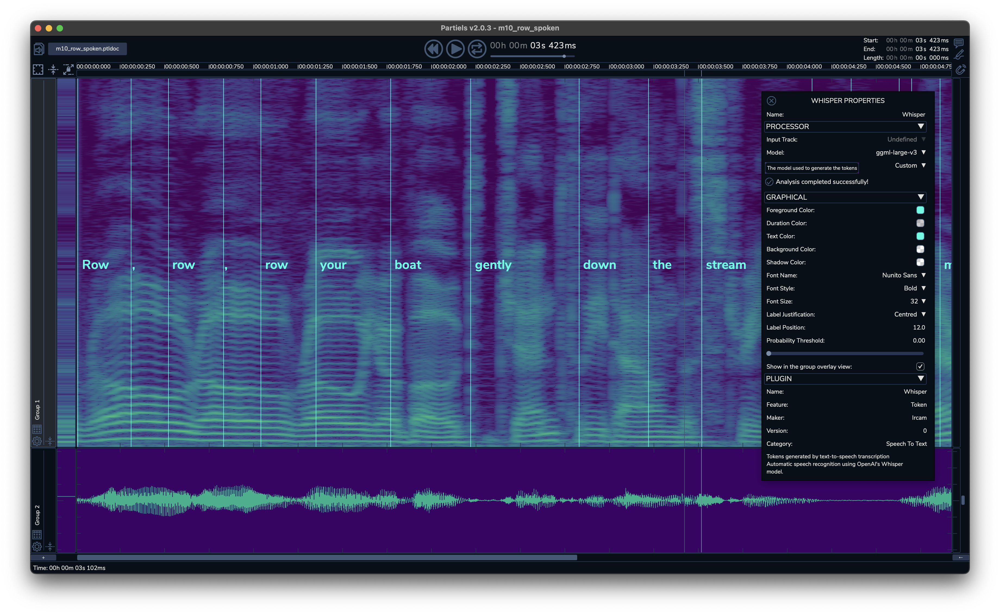

# Whisper Vamp Plugin

<p align="center">
    <a href="https://github.com/Ircam-Partiels/whisper-vamp-plugin/actions/workflows/ci.yml"></a>
  </p>

The Whisper plugin is an implementation of the [Whisper](https://github.com/openai/whisper) speech recognition model developed by [OpenAI](https://openai.com/) as a [Vamp plugin](https://www.vamp-plugins.org/). The Whisper plugin analyses the text in the audio stream and generates markers corresponding to the tokens (words and/or syllables) found. The lightweight ggml-tiny model is embedded in the plugin (so you don’t have to download anything to start experimenting), but it is possible to download and use other models that may be more appropriate to your needs.

The Whisper Vamp Plugin has been designed for use in the free audio analysis application [Partiels](https://forum.ircam.fr/projects/detail/partiels/).

<p align="center">

</p>

## Installation

Download the Whisper Vamp plugin installation package for your operating system from the [Releases](https://github.com/Ircam-Partiels/whisper-vamp-plugin/releases) section and run the installer. 

## Use 

Launch the Partiels application. In a new or existing document, create a new analysis track with the Whisper plugin. Modify the model or the analysis parameters via the property window. Please refer to the manual available in the [Releases](https://github.com/Ircam-Partiels/whisper-vamp-plugin/releases) section for further information.

## Compilation

The compilation system is based on [CMake](https://cmake.org/), for example:
```
cmake . -B build -G Ninja -DCMAKE_BUILD_TYPE=Release
cmake --build build
ctest -C Debug -VV --test-dir build
```

## Credits

- **[Whisper Vamp plugin](https://www.ircam.fr/)** by Pierre Guillot at IRCAM IMR Department
- **[Whisper.cpp](https://github.com/ggerganov/whisper.cpp)** by Georgi Gerganov
- **[Whisper](https://github.com/openai/whisper)** model by OpenAI
- **[Vamp SDK](https://github.com/vamp-plugins/vamp-plugin-sdk)** by Chris Cannam, copyright (c) 2005-2024 Chris Cannam and Centre for Digital Music, Queen Mary, University of London.
- **[Ircam Vamp Extension](https://github.com/Ircam-Partiels/ircam-vamp-extension)** by Pierre Guillot at [IRCAM IMR department](https://www.ircam.fr/).  
